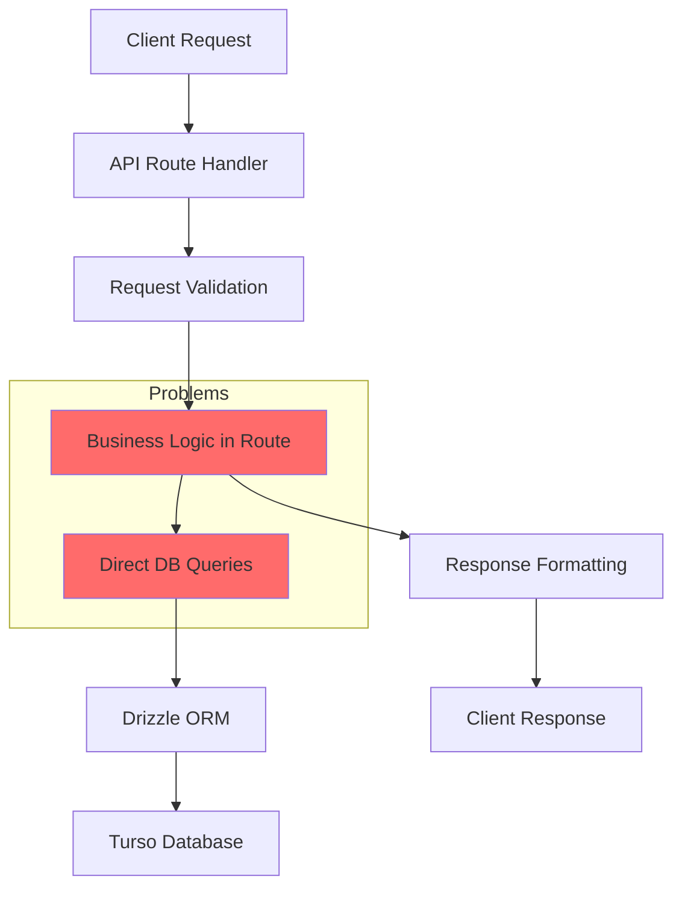
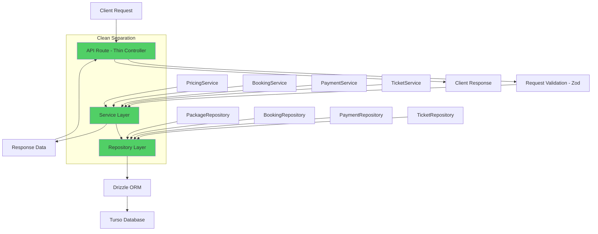
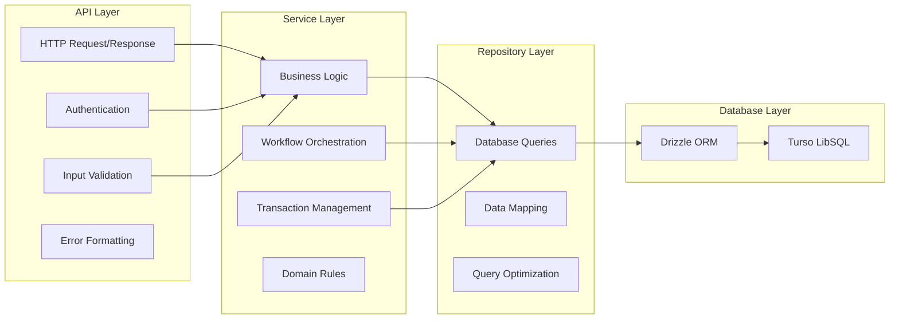
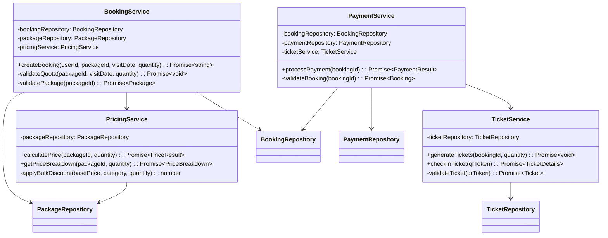
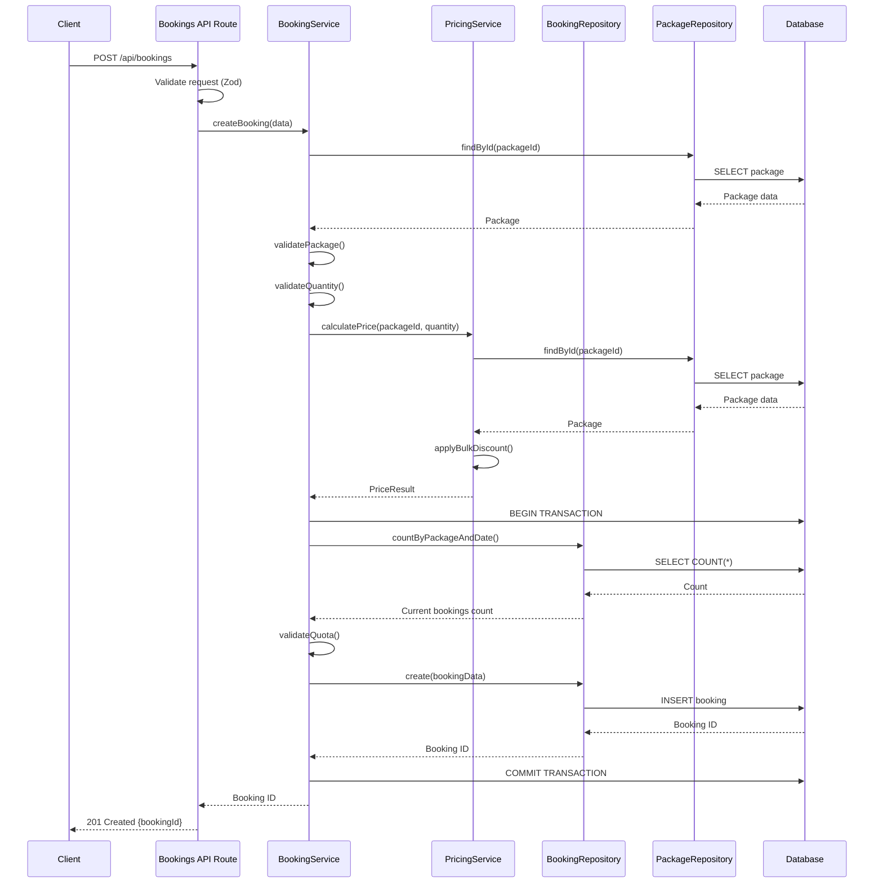
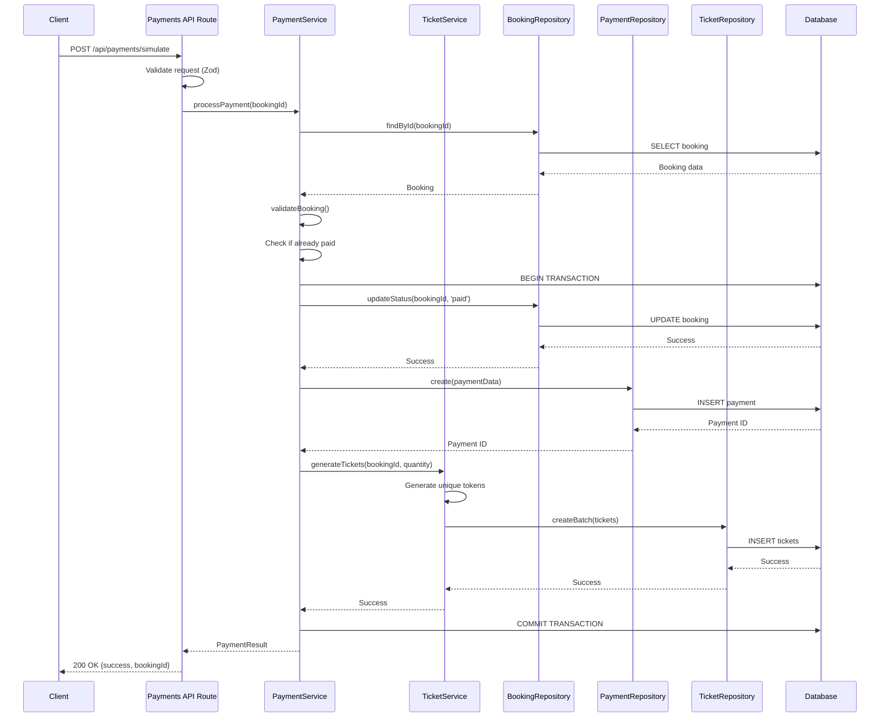
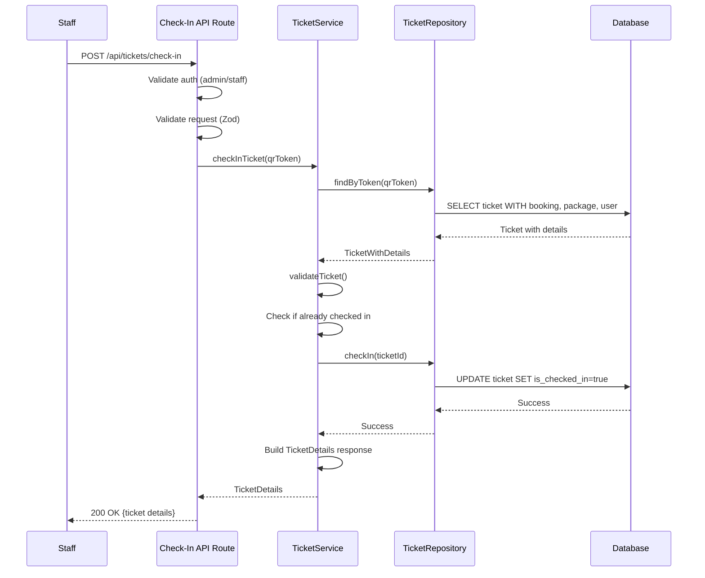

# Design Document: Service Layer Architecture Refactoring

## Overview

This design document specifies the technical architecture for refactoring the Cikapundung Ticketing System from a monolithic API route architecture to a clean, layered architecture with dedicated Service and Repository layers. The refactoring extracts business logic from API routes into testable service classes and isolates all database operations into repository classes.

**Current Architecture Problems:**
- Business logic embedded directly in API routes (pricing, quota validation, payment processing)
- Duplicated pricing calculations between frontend (`BookingForm.tsx`) and backend (`bookings/route.ts`)
- Direct database queries scattered across API routes
- Difficult to test business logic in isolation
- Transaction management mixed with HTTP handling

**Target Architecture Benefits:**
- Clear separation of concerns (API → Service → Repository → Database)
- Single source of truth for business logic
- Testable services with mockable dependencies
- Reusable business logic across multiple API endpoints
- Centralized transaction management
- Easier to extend with new features

**Scope:** Backend refactoring only. No breaking API changes, no UI changes (except removing frontend pricing logic).

---

## Architecture

### Current Architecture (Before Refactoring)



**Problems with Current Architecture:**
- API routes contain 100+ lines of mixed concerns
- Business logic (pricing, quota validation) embedded in routes
- Database queries directly in route handlers
- Difficult to test without HTTP mocking
- Code duplication across routes

### Target Architecture (After Refactoring)



**Benefits of Target Architecture:**
- API routes reduced to 30-50 lines (thin controllers)
- Business logic centralized in services
- Database access isolated in repositories
- Easy to test with mock dependencies
- Clear dependency flow: API → Service → Repository → DB

### Layer Responsibilities



---

## Components and Interfaces

### Service Layer Structure

```
src/
├── services/
│   ├── README.md                    # Service layer documentation
│   ├── pricing.service.ts           # Price calculation and discounts
│   ├── booking.service.ts           # Booking creation and validation
│   ├── payment.service.ts           # Payment processing
│   ├── ticket.service.ts            # QR ticket generation and check-in
│   └── types.ts                     # Shared service types
└── repositories/
    ├── README.md                    # Repository pattern documentation
    ├── package.repository.ts        # Package data access
    ├── booking.repository.ts        # Booking data access
    ├── payment.repository.ts        # Payment data access
    ├── ticket.repository.ts         # Ticket data access
    ├── user.repository.ts           # User data access
    └── types.ts                     # Shared repository types
```

### Service Class Diagram



### Repository Class Diagram

```mermaid
classDiagram
    class PackageRepository {
        -db: DrizzleDB
        +findById(id): Promise~Package | null~
        +findAll(): Promise~Package[]~
        +findActive(): Promise~Package[]~
    }
    
    class BookingRepository {
        -db: DrizzleDB
        +create(data): Promise~string~
        +findById(id): Promise~Booking | null~
        +updateStatus(id, status): Promise~void~
        +countByPackageAndDate(packageId, visitDate): Promise~number~
    }
    
    class PaymentRepository {
        -db: DrizzleDB
        +create(data): Promise~string~
        +findByBookingId(bookingId): Promise~Payment | null~
    }
    
    class TicketRepository {
        -db: DrizzleDB
        +createBatch(tickets): Promise~void~
        +findByToken(qrToken): Promise~TicketWithDetails | null~
        +checkIn(ticketId): Promise~void~
    }
    
    class UserRepository {
        -db: DrizzleDB
        +findById(id): Promise~User | null~
        +findByEmail(email): Promise~User | null~
    }
```



---

## Data Models

### Service Layer Types

```typescript
// src/services/types.ts

export interface PriceResult {
  totalPrice: number;
  pricePerUnit: number;
  discountApplied: boolean;
  discountPercentage: number;
}

export interface PriceBreakdown {
  basePrice: number;
  discountAmount: number;
  finalPrice: number;
  quantity: number;
}

export interface PaymentResult {
  bookingId: string;
  success: boolean;
  message: string;
}

export interface TicketDetails {
  ticketId: string;
  packageName: string;
  visitorName: string;
  visitDate: string;
  checkedInAt: string;
}

export interface CreateBookingData {
  userId: string;
  packageId: string;
  visitDate: string;
  quantity: number;
}
```

### Repository Layer Types

```typescript
// src/repositories/types.ts

export interface Package {
  id: string;
  name: string;
  category: 'personal' | 'school';
  description: string;
  base_price: number;
  promo_price: number | null;
  quota_per_day: number;
  is_active: boolean;
  created_at: string;
}

export interface Booking {
  id: string;
  user_id: string;
  package_id: string;
  visit_date: string;
  quantity: number;
  total_price: number;
  status: 'pending' | 'paid' | 'cancelled';
  created_at: string;
}

export interface Payment {
  id: string;
  booking_id: string;
  provider: string;
  payment_status: 'pending' | 'success' | 'failed';
  external_ref: string | null;
  paid_at: string | null;
  created_at: string;
}

export interface Ticket {
  id: string;
  booking_id: string;
  qr_token: string;
  is_checked_in: boolean;
  checked_in_at: string | null;
  created_at: string;
}

export interface TicketWithDetails extends Ticket {
  booking: Booking & {
    package: Package;
    user: { id: string; name: string; email: string };
  };
}

export interface CreateBookingInput {
  user_id: string;
  package_id: string;
  visit_date: string;
  quantity: number;
  total_price: number;
  status: 'pending' | 'paid' | 'cancelled';
}

export interface CreatePaymentInput {
  booking_id: string;
  provider: string;
  payment_status: 'pending' | 'success' | 'failed';
  external_ref: string | null;
  paid_at: string | null;
}

export interface CreateTicketInput {
  booking_id: string;
  qr_token: string;
  is_checked_in: boolean;
}
```

---

## Detailed Service Implementations

### 1. PricingService

**Purpose:** Centralize all pricing logic and discount calculations

**Dependencies:** PackageRepository

**Methods:**

```typescript
// src/services/pricing.service.ts

import { PackageRepository } from '@/repositories/package.repository';
import type { PriceResult, PriceBreakdown } from './types';

export class PricingService {
  constructor(private packageRepository: PackageRepository) {}

  /**
   * Calculate total price for a booking
   * Applies bulk discounts for school packages
   * 
   * @param packageId - Package ID
   * @param quantity - Number of tickets
   * @returns Price calculation result
   * @throws Error if package not found
   * 
   * Validates: Requirements 2.1, 2.2, 2.3, 2.4, 2.5, 2.6
   */
  async calculatePrice(packageId: string, quantity: number): Promise<PriceResult> {
    const pkg = await this.packageRepository.findById(packageId);
    
    if (!pkg) {
      throw new Error('Package not found');
    }

    // Use promo price if available, otherwise base price
    const basePrice = pkg.promo_price ?? pkg.base_price;
    
    // Apply bulk discount for school packages
    const discountPercentage = this.getDiscountPercentage(pkg.category, quantity);
    const pricePerUnit = this.applyBulkDiscount(basePrice, pkg.category, quantity);
    const totalPrice = pricePerUnit * quantity;

    return {
      totalPrice,
      pricePerUnit,
      discountApplied: discountPercentage > 0,
      discountPercentage,
    };
  }

  /**
   * Get detailed price breakdown
   * 
   * @param packageId - Package ID
   * @param quantity - Number of tickets
   * @returns Detailed price breakdown
   * @throws Error if package not found
   * 
   * Validates: Requirement 2.7
   */
  async getPriceBreakdown(packageId: string, quantity: number): Promise<PriceBreakdown> {
    const pkg = await this.packageRepository.findById(packageId);
    
    if (!pkg) {
      throw new Error('Package not found');
    }

    const basePrice = pkg.promo_price ?? pkg.base_price;
    const baseTotalPrice = basePrice * quantity;
    const discountPercentage = this.getDiscountPercentage(pkg.category, quantity);
    const discountAmount = Math.floor(baseTotalPrice * (discountPercentage / 100));
    const finalPrice = baseTotalPrice - discountAmount;

    return {
      basePrice: baseTotalPrice,
      discountAmount,
      finalPrice,
      quantity,
    };
  }

  /**
   * Apply bulk discount based on category and quantity
   * School packages: 10% off for 50-99, 15% off for 100+
   * Personal packages: No bulk discount
   * 
   * @private
   * Validates: Requirements 2.2, 2.3, 2.4
   */
  private applyBulkDiscount(
    basePrice: number,
    category: 'personal' | 'school',
    quantity: number
  ): number {
    if (category !== 'school') {
      return basePrice;
    }

    if (quantity >= 100) {
      return Math.floor(basePrice * 0.85); // 15% off
    } else if (quantity >= 50) {
      return Math.floor(basePrice * 0.90); // 10% off
    }

    return basePrice;
  }

  /**
   * Get discount percentage for display purposes
   * @private
   */
  private getDiscountPercentage(
    category: 'personal' | 'school',
    quantity: number
  ): number {
    if (category !== 'school') {
      return 0;
    }

    if (quantity >= 100) {
      return 15;
    } else if (quantity >= 50) {
      return 10;
    }

    return 0;
  }
}

// Singleton instance for use in API routes
export const pricingService = new PricingService(packageRepository);
```

### 2. BookingService

**Purpose:** Handle booking creation, validation, and quota management

**Dependencies:** BookingRepository, PackageRepository, PricingService

**Methods:**

```typescript
// src/services/booking.service.ts

import { db } from '@/db';
import { BookingRepository } from '@/repositories/booking.repository';
import { PackageRepository } from '@/repositories/package.repository';
import { PricingService } from './pricing.service';
import type { CreateBookingData } from './types';

export class BookingService {
  constructor(
    private bookingRepository: BookingRepository,
    private packageRepository: PackageRepository,
    private pricingService: PricingService
  ) {}

  /**
   * Create a new booking with quota validation
   * Executes within a transaction to ensure atomicity
   * 
   * @param data - Booking creation data
   * @returns Booking ID
   * @throws Error if validation fails or quota exceeded
   * 
   * Validates: Requirements 4.1-4.10
   */
  async createBooking(data: CreateBookingData): Promise<string> {
    // Validate package exists and is active
    const pkg = await this.validatePackage(data.packageId);

    // Validate quantity
    if (data.quantity < 1) {
      throw new Error('Quantity must be at least 1');
    }

    // Calculate price using PricingService
    const priceResult = await this.pricingService.calculatePrice(
      data.packageId,
      data.quantity
    );

    // Execute quota check and booking creation in transaction
    const bookingId = await db.transaction(async (tx) => {
      // Check quota within transaction
      await this.validateQuota(data.packageId, data.visitDate, data.quantity);

      // Create booking
      const id = await this.bookingRepository.create({
        user_id: data.userId,
        package_id: data.packageId,
        visit_date: data.visitDate,
        quantity: data.quantity,
        total_price: priceResult.totalPrice,
        status: 'pending',
      });

      return id;
    });

    return bookingId;
  }

  /**
   * Validate package exists and is active
   * @private
   * Validates: Requirement 4.2, 4.7
   */
  private async validatePackage(packageId: string) {
    const pkg = await this.packageRepository.findById(packageId);

    if (!pkg || !pkg.is_active) {
      throw new Error('Package not found or inactive');
    }

    return pkg;
  }

  /**
   * Validate quota is not exceeded for the visit date
   * Must be called within a transaction
   * @private
   * Validates: Requirements 4.5, 4.6
   */
  private async validateQuota(
    packageId: string,
    visitDate: string,
    requestedQuantity: number
  ): Promise<void> {
    const pkg = await this.packageRepository.findById(packageId);
    
    if (!pkg) {
      throw new Error('Package not found');
    }

    const currentBookings = await this.bookingRepository.countByPackageAndDate(
      packageId,
      visitDate
    );

    if (currentBookings + requestedQuantity > pkg.quota_per_day) {
      throw new Error('Quota exceeded for this date');
    }
  }
}

// Singleton instance for use in API routes
export const bookingService = new BookingService(
  bookingRepository,
  packageRepository,
  pricingService
);
```


### 3. PaymentService

**Purpose:** Handle payment processing and coordinate ticket generation

**Dependencies:** BookingRepository, PaymentRepository, TicketService

**Methods:**

```typescript
// src/services/payment.service.ts

import { db } from '@/db';
import { BookingRepository } from '@/repositories/booking.repository';
import { PaymentRepository } from '@/repositories/payment.repository';
import { TicketService } from './ticket.service';
import type { PaymentResult } from './types';

export class PaymentService {
  constructor(
    private bookingRepository: BookingRepository,
    private paymentRepository: PaymentRepository,
    private ticketService: TicketService
  ) {}

  /**
   * Process payment for a booking
   * Updates booking status, creates payment record, generates tickets
   * All operations execute within a transaction
   * 
   * @param bookingId - Booking ID to process payment for
   * @returns Payment result with success status
   * @throws Error if booking not found or already paid
   * 
   * Validates: Requirements 5.1-5.10
   */
  async processPayment(bookingId: string): Promise<PaymentResult> {
    // Validate booking exists
    const booking = await this.validateBooking(bookingId);

    // Check if already paid
    if (booking.status === 'paid') {
      throw new Error('Booking already paid');
    }

    // Execute payment processing in transaction
    await db.transaction(async (tx) => {
      // Update booking status to paid
      await this.bookingRepository.updateStatus(bookingId, 'paid');

      // Create payment record
      await this.paymentRepository.create({
        booking_id: bookingId,
        provider: 'mock_gateway',
        payment_status: 'success',
        external_ref: `mock_${Date.now()}`,
        paid_at: new Date().toISOString(),
      });

      // Generate QR tickets
      await this.ticketService.generateTickets(bookingId, booking.quantity);
    });

    return {
      bookingId,
      success: true,
      message: 'Payment successful',
    };
  }

  /**
   * Validate booking exists
   * @private
   * Validates: Requirement 5.2
   */
  private async validateBooking(bookingId: string) {
    const booking = await this.bookingRepository.findById(bookingId);

    if (!booking) {
      throw new Error('Booking not found');
    }

    return booking;
  }
}

// Singleton instance for use in API routes
export const paymentService = new PaymentService(
  bookingRepository,
  paymentRepository,
  ticketService
);
```

### 4. TicketService

**Purpose:** Handle QR ticket generation and check-in operations

**Dependencies:** TicketRepository

**Methods:**

```typescript
// src/services/ticket.service.ts

import { TicketRepository } from '@/repositories/ticket.repository';
import type { TicketDetails } from './types';

export class TicketService {
  constructor(private ticketRepository: TicketRepository) {}

  /**
   * Generate QR tickets for a booking
   * Creates unique tokens for each ticket
   * 
   * @param bookingId - Booking ID
   * @param quantity - Number of tickets to generate
   * @throws Error if ticket creation fails
   * 
   * Validates: Requirements 6.1-6.4, 6.10
   */
  async generateTickets(bookingId: string, quantity: number): Promise<void> {
    const tickets = [];

    for (let i = 0; i < quantity; i++) {
      tickets.push({
        booking_id: bookingId,
        qr_token: crypto.randomUUID(), // Unique token
        is_checked_in: false,
      });
    }

    if (tickets.length > 0) {
      await this.ticketRepository.createBatch(tickets);
    }
  }

  /**
   * Check in a ticket using QR token
   * Validates ticket exists and is not already checked in
   * 
   * @param qrToken - QR token from scanned ticket
   * @returns Ticket details including package and visitor info
   * @throws Error if ticket not found or already used
   * 
   * Validates: Requirements 6.5-6.9
   */
  async checkInTicket(qrToken: string): Promise<TicketDetails> {
    // Validate ticket exists
    const ticket = await this.validateTicket(qrToken);

    // Check if already checked in
    if (ticket.is_checked_in) {
      throw new Error('Ticket already used');
    }

    // Perform check-in
    await this.ticketRepository.checkIn(ticket.id);

    // Return ticket details
    return {
      ticketId: ticket.id,
      packageName: ticket.booking.package.name,
      visitorName: ticket.booking.user.name,
      visitDate: ticket.booking.visit_date,
      checkedInAt: new Date().toISOString(),
    };
  }

  /**
   * Validate ticket exists
   * @private
   * Validates: Requirement 6.6
   */
  private async validateTicket(qrToken: string) {
    const ticket = await this.ticketRepository.findByToken(qrToken);

    if (!ticket) {
      throw new Error('Ticket not found');
    }

    return ticket;
  }
}

// Singleton instance for use in API routes
export const ticketService = new TicketService(ticketRepository);
```

---

## Repository Layer Implementations

### 1. PackageRepository

```typescript
// src/repositories/package.repository.ts

import { db } from '@/db';
import { ticketPackages } from '@/db/schema';
import { eq } from 'drizzle-orm';
import type { Package } from './types';

/**
 * Repository for ticket package data access
 * Encapsulates all database queries for packages
 * 
 * Validates: Requirements 3.1, 3.6
 */
export class PackageRepository {
  /**
   * Find package by ID
   * @param id - Package ID
   * @returns Package or null if not found
   */
  async findById(id: string): Promise<Package | null> {
    const result = await db.query.ticketPackages.findFirst({
      where: eq(ticketPackages.id, id),
    });

    return result ?? null;
  }

  /**
   * Find all packages
   * @returns Array of all packages
   */
  async findAll(): Promise<Package[]> {
    return await db.query.ticketPackages.findMany();
  }

  /**
   * Find all active packages
   * @returns Array of active packages
   */
  async findActive(): Promise<Package[]> {
    return await db.query.ticketPackages.findMany({
      where: eq(ticketPackages.is_active, true),
    });
  }
}

// Singleton instance
export const packageRepository = new PackageRepository();
```

### 2. BookingRepository

```typescript
// src/repositories/booking.repository.ts

import { db } from '@/db';
import { bookings } from '@/db/schema';
import { eq, and, ne, count } from 'drizzle-orm';
import type { Booking, CreateBookingInput } from './types';

/**
 * Repository for booking data access
 * Encapsulates all database queries for bookings
 * 
 * Validates: Requirements 3.2, 3.7-3.9
 */
export class BookingRepository {
  /**
   * Create a new booking
   * @param data - Booking data
   * @returns Booking ID
   * @throws Error if creation fails
   */
  async create(data: CreateBookingInput): Promise<string> {
    const result = await db.insert(bookings).values(data).returning();

    if (!result || result.length === 0) {
      throw new Error('Failed to create booking');
    }

    return result[0].id;
  }

  /**
   * Find booking by ID
   * @param id - Booking ID
   * @returns Booking or null if not found
   */
  async findById(id: string): Promise<Booking | null> {
    const result = await db.query.bookings.findFirst({
      where: eq(bookings.id, id),
    });

    return result ?? null;
  }

  /**
   * Update booking status
   * @param id - Booking ID
   * @param status - New status
   * @throws Error if update fails
   */
  async updateStatus(id: string, status: 'pending' | 'paid' | 'cancelled'): Promise<void> {
    await db.update(bookings)
      .set({ status })
      .where(eq(bookings.id, id));
  }

  /**
   * Count non-cancelled bookings for a package and date
   * Used for quota validation
   * @param packageId - Package ID
   * @param visitDate - Visit date (YYYY-MM-DD)
   * @returns Count of bookings
   */
  async countByPackageAndDate(packageId: string, visitDate: string): Promise<number> {
    const result = await db
      .select({ count: count() })
      .from(bookings)
      .where(
        and(
          eq(bookings.package_id, packageId),
          eq(bookings.visit_date, visitDate),
          ne(bookings.status, 'cancelled')
        )
      );

    return result[0]?.count ?? 0;
  }
}

// Singleton instance
export const bookingRepository = new BookingRepository();
```

### 3. PaymentRepository

```typescript
// src/repositories/payment.repository.ts

import { db } from '@/db';
import { payments } from '@/db/schema';
import { eq } from 'drizzle-orm';
import type { Payment, CreatePaymentInput } from './types';

/**
 * Repository for payment data access
 * Encapsulates all database queries for payments
 * 
 * Validates: Requirements 3.3, 3.10
 */
export class PaymentRepository {
  /**
   * Create a new payment record
   * @param data - Payment data
   * @returns Payment ID
   * @throws Error if creation fails
   */
  async create(data: CreatePaymentInput): Promise<string> {
    const result = await db.insert(payments).values(data).returning();

    if (!result || result.length === 0) {
      throw new Error('Failed to create payment');
    }

    return result[0].id;
  }

  /**
   * Find payment by booking ID
   * @param bookingId - Booking ID
   * @returns Payment or null if not found
   */
  async findByBookingId(bookingId: string): Promise<Payment | null> {
    const result = await db.query.payments.findFirst({
      where: eq(payments.booking_id, bookingId),
    });

    return result ?? null;
  }
}

// Singleton instance
export const paymentRepository = new PaymentRepository();
```

### 4. TicketRepository

```typescript
// src/repositories/ticket.repository.ts

import { db } from '@/db';
import { qrTickets } from '@/db/schema';
import { eq } from 'drizzle-orm';
import type { Ticket, TicketWithDetails, CreateTicketInput } from './types';

/**
 * Repository for QR ticket data access
 * Encapsulates all database queries for tickets
 * 
 * Validates: Requirements 3.4, 3.11-3.13
 */
export class TicketRepository {
  /**
   * Create multiple tickets in batch
   * @param tickets - Array of ticket data
   * @throws Error if creation fails
   */
  async createBatch(tickets: CreateTicketInput[]): Promise<void> {
    if (tickets.length === 0) {
      return;
    }

    await db.insert(qrTickets).values(tickets);
  }

  /**
   * Find ticket by QR token with full details
   * Includes booking, package, and user information
   * @param qrToken - QR token
   * @returns Ticket with details or null if not found
   */
  async findByToken(qrToken: string): Promise<TicketWithDetails | null> {
    const result = await db.query.qrTickets.findFirst({
      where: eq(qrTickets.qr_token, qrToken),
      with: {
        booking: {
          with: {
            package: true,
            user: true,
          },
        },
      },
    });

    return result ?? null;
  }

  /**
   * Mark ticket as checked in
   * @param ticketId - Ticket ID
   * @throws Error if update fails
   */
  async checkIn(ticketId: string): Promise<void> {
    await db.update(qrTickets)
      .set({
        is_checked_in: true,
        checked_in_at: new Date().toISOString(),
      })
      .where(eq(qrTickets.id, ticketId));
  }
}

// Singleton instance
export const ticketRepository = new TicketRepository();
```

### 5. UserRepository

```typescript
// src/repositories/user.repository.ts

import { db } from '@/db';
import { users } from '@/db/schema';
import { eq } from 'drizzle-orm';

/**
 * Repository for user data access
 * Encapsulates all database queries for users
 * 
 * Validates: Requirement 3.5
 */
export class UserRepository {
  /**
   * Find user by ID
   * @param id - User ID
   * @returns User or null if not found
   */
  async findById(id: string) {
    const result = await db.query.users.findFirst({
      where: eq(users.id, id),
    });

    return result ?? null;
  }

  /**
   * Find user by email
   * @param email - User email
   * @returns User or null if not found
   */
  async findByEmail(email: string) {
    const result = await db.query.users.findFirst({
      where: eq(users.email, email),
    });

    return result ?? null;
  }
}

// Singleton instance
export const userRepository = new UserRepository();
```

---

## API Route Refactoring

### Refactored Bookings API Route

**Before (100+ lines with business logic):**

```typescript
// Current implementation - BEFORE refactoring
export async function POST(req: Request) {
  const session = await getServerSession(authOptions);
  if (!session) {
    return NextResponse.json({ message: 'Unauthorized' }, { status: 401 });
  }

  try {
    const body = await req.json();
    const { packageId, visitDate, quantity } = bookingSchema.parse(body);

    // Business logic embedded in route
    const pkg = await db.query.ticketPackages.findFirst({
      where: eq(ticketPackages.id, packageId),
    });

    if (!pkg || !pkg.is_active) {
      return NextResponse.json({ message: 'Package not found or inactive' }, { status: 404 });
    }

    const bookingId = await db.transaction(async (tx) => {
      // Quota validation logic
      const currentBookings = await tx
        .select({ count: count() })
        .from(bookings)
        .where(and(
            eq(bookings.package_id, packageId),
            eq(bookings.visit_date, visitDate),
            ne(bookings.status, 'cancelled')
        ));
        
      const currentCount = currentBookings[0]?.count ?? 0;

      if (currentCount + quantity > pkg.quota_per_day) {
        throw new Error('Quota exceeded for this date');
      }

      // Pricing logic
      let pricePerPax = pkg.promo_price ?? pkg.base_price;
      
      if (pkg.category === 'school') {
        if (quantity >= 100) {
          pricePerPax = Math.floor(pricePerPax * 0.85);
        } else if (quantity >= 50) {
          pricePerPax = Math.floor(pricePerPax * 0.90);
        }
      }

      const totalPrice = pricePerPax * quantity;

      // Database operation
      const newBooking = await tx.insert(bookings).values({
        user_id: session.user.id,
        package_id: packageId,
        visit_date: visitDate,
        quantity,
        total_price: totalPrice,
        status: 'pending',
      }).returning();
      
      if (!newBooking || newBooking.length === 0) {
          throw new Error('Failed to create booking');
      }

      return newBooking[0].id;
    });

    return NextResponse.json({ bookingId, message: 'Booking created' }, { status: 201 });

  } catch (error: any) {
    if (error instanceof z.ZodError) {
      return NextResponse.json({ message: 'Validation failed', errors: error.issues }, { status: 400 });
    }
    return NextResponse.json({ message: error.message || 'Internal server error' }, { status: 500 });
  }
}
```

**After (Thin controller - 35 lines):**

```typescript
// src/app/api/bookings/route.ts
// Refactored implementation - AFTER

import { NextResponse } from 'next/server';
import { getServerSession } from 'next-auth';
import { authOptions } from '@/lib/auth';
import { bookingService } from '@/services/booking.service';
import { z } from 'zod';

const bookingSchema = z.object({
  packageId: z.string(),
  visitDate: z.string().regex(/^\d{4}-\d{2}-\d{2}$/, 'Invalid date format'),
  quantity: z.number().min(1),
});

/**
 * Create a new booking
 * Thin controller - delegates to BookingService
 * 
 * Validates: Requirements 7.1-7.10
 */
export async function POST(req: Request) {
  const session = await getServerSession(authOptions);

  if (!session) {
    return NextResponse.json({ message: 'Unauthorized' }, { status: 401 });
  }

  try {
    // Validate request body
    const body = await req.json();
    const { packageId, visitDate, quantity } = bookingSchema.parse(body);

    // Delegate to service layer
    const bookingId = await bookingService.createBooking({
      userId: session.user.id,
      packageId,
      visitDate,
      quantity,
    });

    return NextResponse.json(
      { bookingId, message: 'Booking created' },
      { status: 201 }
    );
  } catch (error: any) {
    if (error instanceof z.ZodError) {
      return NextResponse.json(
        { message: 'Validation failed', errors: error.issues },
        { status: 400 }
      );
    }

    // Map service errors to HTTP status codes
    const statusCode = error.message.includes('not found') ? 404 : 
                       error.message.includes('exceeded') ? 400 : 500;

    return NextResponse.json(
      { message: error.message || 'Internal server error' },
      { status: statusCode }
    );
  }
}
```

**Key Improvements:**
- Reduced from 100+ lines to 35 lines
- No business logic in route
- No direct database queries
- Clear separation of concerns
- Easy to test service independently
- Maintains backward compatibility


### Refactored Payments API Route

**Before (70+ lines with business logic):**

```typescript
// Current implementation - BEFORE refactoring
export async function POST(req: Request) {
  const session = await getServerSession(authOptions);

  if (!session) {
    return NextResponse.json({ message: 'Unauthorized' }, { status: 401 });
  }

  try {
    const body = await req.json();
    const { bookingId } = paymentSchema.parse(body);

    const booking = await db.query.bookings.findFirst({
      where: eq(bookings.id, bookingId),
    });

    if (!booking) {
      return NextResponse.json({ message: 'Booking not found' }, { status: 404 });
    }

    if (booking.status === 'paid') {
      return NextResponse.json({ message: 'Booking already paid' }, { status: 400 });
    }

    await db.transaction(async (tx: any) => {
      await tx.update(bookings)
        .set({ status: 'paid' })
        .where(eq(bookings.id, bookingId));

      await tx.insert(payments).values({
        booking_id: bookingId,
        provider: 'mock_gateway',
        payment_status: 'success',
        external_ref: `mock_${Date.now()}`,
        paid_at: new Date().toISOString(),
      });

      const tickets = [];
      for (let i = 0; i < booking.quantity; i++) {
        tickets.push({
          booking_id: bookingId,
          qr_token: crypto.randomUUID(),
          is_checked_in: false,
        });
      }

      if (tickets.length > 0) {
        await tx.insert(qrTickets).values(tickets);
      }
    });

    return NextResponse.json({ message: 'Payment successful', bookingId }, { status: 200 });

  } catch (error: any) {
    if (error instanceof z.ZodError) {
      return NextResponse.json({ message: 'Validation failed', errors: error.issues }, { status: 400 });
    }
    return NextResponse.json({ message: error.message || 'Internal server error' }, { status: 500 });
  }
}
```

**After (Thin controller - 30 lines):**

```typescript
// src/app/api/payments/simulate/route.ts
// Refactored implementation - AFTER

import { NextResponse } from 'next/server';
import { getServerSession } from 'next-auth';
import { authOptions } from '@/lib/auth';
import { paymentService } from '@/services/payment.service';
import { z } from 'zod';

const paymentSchema = z.object({
  bookingId: z.string(),
});

/**
 * Process payment for a booking
 * Thin controller - delegates to PaymentService
 * 
 * Validates: Requirements 8.1-8.10
 */
export async function POST(req: Request) {
  const session = await getServerSession(authOptions);

  if (!session) {
    return NextResponse.json({ message: 'Unauthorized' }, { status: 401 });
  }

  try {
    // Validate request body
    const body = await req.json();
    const { bookingId } = paymentSchema.parse(body);

    // Delegate to service layer
    const result = await paymentService.processPayment(bookingId);

    return NextResponse.json(
      { message: result.message, bookingId: result.bookingId },
      { status: 200 }
    );
  } catch (error: any) {
    if (error instanceof z.ZodError) {
      return NextResponse.json(
        { message: 'Validation failed', errors: error.issues },
        { status: 400 }
      );
    }

    // Map service errors to HTTP status codes
    const statusCode = error.message.includes('not found') ? 404 :
                       error.message.includes('already paid') ? 400 : 500;

    return NextResponse.json(
      { message: error.message || 'Internal server error' },
      { status: statusCode }
    );
  }
}
```

### Refactored Ticket Check-In API Route

**Before (60+ lines with business logic):**

```typescript
// Current implementation - BEFORE refactoring
export async function POST(req: Request) {
  const session = await getServerSession(authOptions);

  if (!session || (session.user.role !== 'admin' && session.user.role !== 'staff')) {
    return NextResponse.json({ message: 'Unauthorized' }, { status: 401 });
  }

  try {
    const body = await req.json();
    const { qrToken } = checkInSchema.parse(body);

    const ticket = await db.query.qrTickets.findFirst({
      where: eq(qrTickets.qr_token, qrToken),
      with: {
        booking: {
          with: {
            package: true,
            user: true,
          }
        }
      }
    });

    if (!ticket) {
      return NextResponse.json({ message: 'Ticket not found' }, { status: 404 });
    }

    if (ticket.is_checked_in) {
      return NextResponse.json({ 
        message: 'Ticket already used', 
        ticket: {
            id: ticket.id,
            checkedInAt: ticket.checked_in_at,
            packageName: ticket.booking.package.name,
            visitorName: ticket.booking.user.name,
        }
      }, { status: 400 });
    }

    await db.update(qrTickets)
      .set({ 
        is_checked_in: true, 
        checked_in_at: new Date().toISOString() 
      })
      .where(eq(qrTickets.id, ticket.id));

    return NextResponse.json({ 
      message: 'Check-in successful',
      ticket: {
        id: ticket.id,
        packageName: ticket.booking.package.name,
        visitorName: ticket.booking.user.name,
        visitDate: ticket.booking.visit_date,
      }
    }, { status: 200 });

  } catch (error: any) {
    if (error instanceof z.ZodError) {
      return NextResponse.json({ message: 'Validation failed', errors: error.issues }, { status: 400 });
    }
    return NextResponse.json({ message: error.message || 'Internal server error' }, { status: 500 });
  }
}
```

**After (Thin controller - 35 lines):**

```typescript
// src/app/api/tickets/check-in/route.ts
// Refactored implementation - AFTER

import { NextResponse } from 'next/server';
import { getServerSession } from 'next-auth';
import { authOptions } from '@/lib/auth';
import { ticketService } from '@/services/ticket.service';
import { z } from 'zod';

const checkInSchema = z.object({
  qrToken: z.string(),
});

/**
 * Check in a ticket using QR token
 * Thin controller - delegates to TicketService
 * 
 * Validates: Requirements 9.1-9.10
 */
export async function POST(req: Request) {
  const session = await getServerSession(authOptions);

  // Preserve authorization checks for admin and staff roles
  if (!session || (session.user.role !== 'admin' && session.user.role !== 'staff')) {
    return NextResponse.json({ message: 'Unauthorized' }, { status: 401 });
  }

  try {
    // Validate request body
    const body = await req.json();
    const { qrToken } = checkInSchema.parse(body);

    // Delegate to service layer
    const ticketDetails = await ticketService.checkInTicket(qrToken);

    return NextResponse.json(
      {
        message: 'Check-in successful',
        ticket: {
          id: ticketDetails.ticketId,
          packageName: ticketDetails.packageName,
          visitorName: ticketDetails.visitorName,
          visitDate: ticketDetails.visitDate,
        },
      },
      { status: 200 }
    );
  } catch (error: any) {
    if (error instanceof z.ZodError) {
      return NextResponse.json(
        { message: 'Validation failed', errors: error.issues },
        { status: 400 }
      );
    }

    // Map service errors to HTTP status codes
    const statusCode = error.message.includes('not found') ? 404 :
                       error.message.includes('already used') ? 400 : 500;

    return NextResponse.json(
      { message: error.message || 'Internal server error' },
      { status: statusCode }
    );
  }
}
```

### New Calculate Price API Route

**Purpose:** Provide backend pricing calculation for frontend

```typescript
// src/app/api/packages/calculate-price/route.ts
// NEW endpoint for frontend pricing

import { NextResponse } from 'next/server';
import { pricingService } from '@/services/pricing.service';
import { z } from 'zod';

const calculatePriceSchema = z.object({
  packageId: z.string(),
  quantity: z.number().min(1),
});

/**
 * Calculate price for a package and quantity
 * Used by frontend to display accurate pricing
 * 
 * Validates: Requirements 10.4, 10.5
 */
export async function POST(req: Request) {
  try {
    // Validate request body
    const body = await req.json();
    const { packageId, quantity } = calculatePriceSchema.parse(body);

    // Delegate to pricing service
    const priceResult = await pricingService.calculatePrice(packageId, quantity);

    return NextResponse.json(
      {
        totalPrice: priceResult.totalPrice,
        pricePerUnit: priceResult.pricePerUnit,
        discountApplied: priceResult.discountApplied,
        discountPercentage: priceResult.discountPercentage,
      },
      { status: 200 }
    );
  } catch (error: any) {
    if (error instanceof z.ZodError) {
      return NextResponse.json(
        { message: 'Validation failed', errors: error.issues },
        { status: 400 }
      );
    }

    const statusCode = error.message.includes('not found') ? 404 : 500;

    return NextResponse.json(
      { message: error.message || 'Internal server error' },
      { status: statusCode }
    );
  }
}
```

---

## Sequence Diagrams

### Booking Creation Flow



### Payment Processing Flow



### Ticket Check-In Flow



---

## Error Handling

### Error Handling Strategy

**Principle:** Services throw descriptive errors, API routes map to HTTP status codes

```typescript
// Service Layer Error Handling Pattern

class BookingService {
  async createBooking(data: CreateBookingData): Promise<string> {
    // Throw descriptive errors
    if (!pkg || !pkg.is_active) {
      throw new Error('Package not found or inactive'); // Maps to 404
    }

    if (currentCount + quantity > pkg.quota_per_day) {
      throw new Error('Quota exceeded for this date'); // Maps to 400
    }

    // Let unexpected errors bubble up (maps to 500)
  }
}

// API Route Error Handling Pattern

export async function POST(req: Request) {
  try {
    const result = await service.method();
    return NextResponse.json(result, { status: 200 });
  } catch (error: any) {
    // Validation errors
    if (error instanceof z.ZodError) {
      return NextResponse.json(
        { message: 'Validation failed', errors: error.issues },
        { status: 400 }
      );
    }

    // Map service errors to HTTP status codes
    const statusCode = 
      error.message.includes('not found') ? 404 :
      error.message.includes('exceeded') ? 400 :
      error.message.includes('already') ? 400 : 500;

    return NextResponse.json(
      { message: error.message || 'Internal server error' },
      { status: statusCode }
    );
  }
}
```

### Error Response Format

All error responses follow consistent format:

```typescript
{
  "message": "Descriptive error message",
  "errors": [] // Optional: Zod validation errors
}
```

### Error Mapping Table

| Service Error Message | HTTP Status | Description |
|----------------------|-------------|-------------|
| "Package not found" | 404 | Package doesn't exist |
| "Package not found or inactive" | 404 | Package inactive or missing |
| "Booking not found" | 404 | Booking doesn't exist |
| "Ticket not found" | 404 | Ticket doesn't exist |
| "Quota exceeded for this date" | 400 | Daily quota reached |
| "Booking already paid" | 400 | Payment already processed |
| "Ticket already used" | 400 | Ticket already checked in |
| "Quantity must be at least 1" | 400 | Invalid quantity |
| Validation failed (Zod) | 400 | Request body validation failed |
| Any other error | 500 | Unexpected server error |

---

## Transaction Management

### Transaction Boundaries

**Principle:** Use transactions for multi-step operations that must be atomic

```typescript
// Transaction Pattern in Services

class BookingService {
  async createBooking(data: CreateBookingData): Promise<string> {
    // Execute in transaction
    const bookingId = await db.transaction(async (tx) => {
      // Step 1: Check quota (must be in transaction for consistency)
      await this.validateQuota(data.packageId, data.visitDate, data.quantity);

      // Step 2: Create booking
      const id = await this.bookingRepository.create({
        user_id: data.userId,
        package_id: data.packageId,
        visit_date: data.visitDate,
        quantity: data.quantity,
        total_price: priceResult.totalPrice,
        status: 'pending',
      });

      return id;
    });

    return bookingId;
  }
}
```

### Transaction Requirements

| Operation | Requires Transaction | Reason |
|-----------|---------------------|---------|
| Booking creation | ✅ Yes | Quota check + insert must be atomic |
| Payment processing | ✅ Yes | Booking update + payment insert + ticket generation must be atomic |
| Ticket check-in | ❌ No | Single update operation |
| Price calculation | ❌ No | Read-only operation |
| Package lookup | ❌ No | Read-only operation |

### Transaction Rollback Strategy

```typescript
// Automatic rollback on error

await db.transaction(async (tx) => {
  await operation1(tx); // If this fails, rollback
  await operation2(tx); // If this fails, rollback
  await operation3(tx); // If this fails, rollback
  // All succeed: commit
});

// Error handling
try {
  await db.transaction(async (tx) => {
    // Operations
  });
} catch (error) {
  // Transaction automatically rolled back
  // Re-throw with descriptive message
  throw new Error('Operation failed: ' + error.message);
}
```

---

## Testing Strategy

### Unit Testing Services

**Principle:** Test services in isolation with mock repositories

```typescript
// Example: PricingService unit test

import { PricingService } from '@/services/pricing.service';
import { PackageRepository } from '@/repositories/package.repository';

describe('PricingService', () => {
  let pricingService: PricingService;
  let mockPackageRepository: jest.Mocked<PackageRepository>;

  beforeEach(() => {
    mockPackageRepository = {
      findById: jest.fn(),
    } as any;

    pricingService = new PricingService(mockPackageRepository);
  });

  describe('calculatePrice', () => {
    it('should calculate price without discount for personal package', async () => {
      // Arrange
      mockPackageRepository.findById.mockResolvedValue({
        id: '1',
        category: 'personal',
        base_price: 50000,
        promo_price: null,
        // ... other fields
      });

      // Act
      const result = await pricingService.calculatePrice('1', 10);

      // Assert
      expect(result.totalPrice).toBe(500000);
      expect(result.discountApplied).toBe(false);
    });

    it('should apply 10% discount for school package with 50-99 tickets', async () => {
      // Arrange
      mockPackageRepository.findById.mockResolvedValue({
        id: '1',
        category: 'school',
        base_price: 50000,
        promo_price: null,
        // ... other fields
      });

      // Act
      const result = await pricingService.calculatePrice('1', 75);

      // Assert
      expect(result.pricePerUnit).toBe(45000); // 10% off
      expect(result.totalPrice).toBe(3375000);
      expect(result.discountApplied).toBe(true);
      expect(result.discountPercentage).toBe(10);
    });

    it('should apply 15% discount for school package with 100+ tickets', async () => {
      // Arrange
      mockPackageRepository.findById.mockResolvedValue({
        id: '1',
        category: 'school',
        base_price: 50000,
        promo_price: null,
        // ... other fields
      });

      // Act
      const result = await pricingService.calculatePrice('1', 150);

      // Assert
      expect(result.pricePerUnit).toBe(42500); // 15% off
      expect(result.totalPrice).toBe(6375000);
      expect(result.discountApplied).toBe(true);
      expect(result.discountPercentage).toBe(15);
    });

    it('should throw error if package not found', async () => {
      // Arrange
      mockPackageRepository.findById.mockResolvedValue(null);

      // Act & Assert
      await expect(pricingService.calculatePrice('999', 10))
        .rejects.toThrow('Package not found');
    });
  });
});
```


### Integration Testing Services

**Principle:** Test services with real database (test environment)

```typescript
// Example: BookingService integration test

import { BookingService } from '@/services/booking.service';
import { bookingService } from '@/services/booking.service';
import { db } from '@/db';
import { bookings, ticketPackages } from '@/db/schema';

describe('BookingService Integration', () => {
  beforeEach(async () => {
    // Clean database
    await db.delete(bookings);
    await db.delete(ticketPackages);

    // Seed test data
    await db.insert(ticketPackages).values({
      id: 'test-pkg-1',
      name: 'Test Package',
      category: 'school',
      base_price: 50000,
      promo_price: null,
      quota_per_day: 100,
      is_active: true,
    });
  });

  it('should create booking successfully', async () => {
    const bookingId = await bookingService.createBooking({
      userId: 'user-1',
      packageId: 'test-pkg-1',
      visitDate: '2024-12-25',
      quantity: 50,
    });

    expect(bookingId).toBeDefined();

    const booking = await db.query.bookings.findFirst({
      where: eq(bookings.id, bookingId),
    });

    expect(booking).toBeDefined();
    expect(booking.status).toBe('pending');
    expect(booking.quantity).toBe(50);
  });

  it('should reject booking when quota exceeded', async () => {
    // Create booking that fills quota
    await bookingService.createBooking({
      userId: 'user-1',
      packageId: 'test-pkg-1',
      visitDate: '2024-12-25',
      quantity: 100,
    });

    // Attempt to create another booking
    await expect(
      bookingService.createBooking({
        userId: 'user-2',
        packageId: 'test-pkg-1',
        visitDate: '2024-12-25',
        quantity: 1,
      })
    ).rejects.toThrow('Quota exceeded for this date');
  });
});
```

### End-to-End API Testing

**Principle:** Test API routes to verify backward compatibility

```typescript
// Example: Bookings API E2E test

import { POST } from '@/app/api/bookings/route';
import { getServerSession } from 'next-auth';

jest.mock('next-auth');

describe('POST /api/bookings', () => {
  beforeEach(() => {
    (getServerSession as jest.Mock).mockResolvedValue({
      user: { id: 'user-1', email: 'test@example.com' },
    });
  });

  it('should create booking and return 201', async () => {
    const request = new Request('http://localhost/api/bookings', {
      method: 'POST',
      body: JSON.stringify({
        packageId: 'test-pkg-1',
        visitDate: '2024-12-25',
        quantity: 10,
      }),
    });

    const response = await POST(request);
    const data = await response.json();

    expect(response.status).toBe(201);
    expect(data.bookingId).toBeDefined();
    expect(data.message).toBe('Booking created');
  });

  it('should return 400 for invalid date format', async () => {
    const request = new Request('http://localhost/api/bookings', {
      method: 'POST',
      body: JSON.stringify({
        packageId: 'test-pkg-1',
        visitDate: 'invalid-date',
        quantity: 10,
      }),
    });

    const response = await POST(request);
    const data = await response.json();

    expect(response.status).toBe(400);
    expect(data.message).toBe('Validation failed');
  });

  it('should return 404 for non-existent package', async () => {
    const request = new Request('http://localhost/api/bookings', {
      method: 'POST',
      body: JSON.stringify({
        packageId: 'non-existent',
        visitDate: '2024-12-25',
        quantity: 10,
      }),
    });

    const response = await POST(request);
    const data = await response.json();

    expect(response.status).toBe(404);
    expect(data.message).toContain('not found');
  });
});
```

### Property-Based Testing for Pricing

**Principle:** Verify pricing logic across input ranges

```typescript
// Example: Property-based test for pricing

import { fc, test } from '@fast-check/jest';
import { PricingService } from '@/services/pricing.service';

describe('PricingService Properties', () => {
  test.prop([fc.integer({ min: 1, max: 200 })])(
    'price should always be positive for any quantity',
    async (quantity) => {
      const mockRepo = {
        findById: jest.fn().mockResolvedValue({
          id: '1',
          category: 'school',
          base_price: 50000,
          promo_price: null,
        }),
      };

      const service = new PricingService(mockRepo as any);
      const result = await service.calculatePrice('1', quantity);

      expect(result.totalPrice).toBeGreaterThan(0);
      expect(result.pricePerUnit).toBeGreaterThan(0);
    }
  );

  test.prop([fc.integer({ min: 1, max: 49 })])(
    'school package with quantity < 50 should have no discount',
    async (quantity) => {
      const mockRepo = {
        findById: jest.fn().mockResolvedValue({
          id: '1',
          category: 'school',
          base_price: 50000,
          promo_price: null,
        }),
      };

      const service = new PricingService(mockRepo as any);
      const result = await service.calculatePrice('1', quantity);

      expect(result.discountApplied).toBe(false);
      expect(result.pricePerUnit).toBe(50000);
    }
  );

  test.prop([fc.integer({ min: 50, max: 99 })])(
    'school package with quantity 50-99 should have 10% discount',
    async (quantity) => {
      const mockRepo = {
        findById: jest.fn().mockResolvedValue({
          id: '1',
          category: 'school',
          base_price: 50000,
          promo_price: null,
        }),
      };

      const service = new PricingService(mockRepo as any);
      const result = await service.calculatePrice('1', quantity);

      expect(result.discountApplied).toBe(true);
      expect(result.discountPercentage).toBe(10);
      expect(result.pricePerUnit).toBe(45000);
    }
  );

  test.prop([fc.integer({ min: 100, max: 500 })])(
    'school package with quantity >= 100 should have 15% discount',
    async (quantity) => {
      const mockRepo = {
        findById: jest.fn().mockResolvedValue({
          id: '1',
          category: 'school',
          base_price: 50000,
          promo_price: null,
        }),
      };

      const service = new PricingService(mockRepo as any);
      const result = await service.calculatePrice('1', quantity);

      expect(result.discountApplied).toBe(true);
      expect(result.discountPercentage).toBe(15);
      expect(result.pricePerUnit).toBe(42500);
    }
  );
});
```

---

## Migration Strategy

### Phase 1: Repository Layer (Week 1)

**Goal:** Create repository layer and migrate database queries

**Steps:**
1. Create `/src/repositories/` directory structure
2. Implement all repository classes with TypeScript interfaces
3. Write unit tests for repositories (with test database)
4. Create repository README documentation

**Deliverables:**
- ✅ PackageRepository with findById, findAll, findActive
- ✅ BookingRepository with create, findById, updateStatus, countByPackageAndDate
- ✅ PaymentRepository with create, findByBookingId
- ✅ TicketRepository with createBatch, findByToken, checkIn
- ✅ UserRepository with findById, findByEmail
- ✅ Repository unit tests (100% coverage)
- ✅ Repository documentation

**Risk Mitigation:**
- Test repositories against real database in test environment
- Verify query performance with EXPLAIN
- Ensure indexes are properly used

### Phase 2: Service Layer (Week 2)

**Goal:** Create service layer and extract business logic

**Steps:**
1. Create `/src/services/` directory structure
2. Implement PricingService (no database dependencies)
3. Implement BookingService (depends on repositories)
4. Implement PaymentService (depends on repositories + TicketService)
5. Implement TicketService (depends on repositories)
6. Write unit tests for services with mock repositories
7. Write integration tests for services with real database
8. Create service README documentation

**Deliverables:**
- ✅ PricingService with calculatePrice, getPriceBreakdown
- ✅ BookingService with createBooking
- ✅ PaymentService with processPayment
- ✅ TicketService with generateTickets, checkInTicket
- ✅ Service unit tests (100% coverage)
- ✅ Service integration tests
- ✅ Service documentation

**Risk Mitigation:**
- Test services in isolation with mocks
- Verify transaction behavior with integration tests
- Ensure error handling is consistent

### Phase 3: API Route Refactoring (Week 3)

**Goal:** Refactor API routes to use services (thin controllers)

**Steps:**
1. Refactor `/api/bookings/route.ts` to use BookingService
2. Refactor `/api/payments/simulate/route.ts` to use PaymentService
3. Refactor `/api/tickets/check-in/route.ts` to use TicketService
4. Write E2E tests for all refactored routes
5. Verify backward compatibility with existing tests
6. Deploy to staging environment

**Deliverables:**
- ✅ Refactored bookings API route (< 50 lines)
- ✅ Refactored payments API route (< 40 lines)
- ✅ Refactored check-in API route (< 40 lines)
- ✅ E2E tests for all routes
- ✅ Backward compatibility verified
- ✅ Staging deployment successful

**Risk Mitigation:**
- Keep old code in comments during initial refactoring
- Run parallel tests (old vs new implementation)
- Monitor error rates in staging
- Maintain rollback plan

### Phase 4: Frontend Pricing Removal (Week 4)

**Goal:** Remove frontend pricing logic and use backend API

**Steps:**
1. Create `/api/packages/calculate-price` endpoint
2. Update BookingForm component to call backend API
3. Add loading state for price calculation
4. Add error handling for API failures
5. Test frontend with various quantities
6. Deploy to staging and verify UX

**Deliverables:**
- ✅ Calculate price API endpoint
- ✅ Updated BookingForm component (no pricing logic)
- ✅ Loading indicator during price calculation
- ✅ Error handling for API failures
- ✅ Frontend tests updated
- ✅ UX verified in staging

**Risk Mitigation:**
- Add debouncing to prevent excessive API calls
- Cache price results for same inputs
- Provide fallback UI if API fails
- Monitor API response times

### Phase 5: Testing and Documentation (Week 5)

**Goal:** Comprehensive testing and documentation

**Steps:**
1. Write property-based tests for pricing logic
2. Write integration tests for complete workflows
3. Update technical architecture documentation
4. Create migration guide for developers
5. Conduct code review
6. Deploy to production

**Deliverables:**
- ✅ Property-based tests for pricing
- ✅ Integration tests for booking → payment → check-in flow
- ✅ Updated architecture documentation
- ✅ Developer migration guide
- ✅ Code review completed
- ✅ Production deployment

**Risk Mitigation:**
- Run load tests to verify performance
- Monitor production metrics closely
- Have rollback plan ready
- Gradual rollout with feature flag

### Rollback Strategy

**If issues arise in production:**

1. **Immediate Rollback:**
   - Revert to previous deployment
   - Restore old API route implementations
   - Monitor error rates return to normal

2. **Partial Rollback:**
   - Use feature flag to toggle between old and new implementation
   - Route percentage of traffic to new implementation
   - Gradually increase percentage as confidence grows

3. **Code Preservation:**
   - Keep old implementation in comments for 2 weeks
   - Maintain git tags for each phase
   - Document rollback procedures

### Success Metrics

**Code Quality:**
- API routes reduced from 100+ lines to < 50 lines
- Service layer test coverage > 95%
- Repository layer test coverage > 95%
- Zero code duplication for pricing logic

**Performance:**
- API response times unchanged or improved
- Database query count unchanged or reduced
- Transaction success rate > 99.9%

**Maintainability:**
- New features can be added to services without touching API routes
- Business logic changes isolated to service layer
- Easy to test new features in isolation

---

## Code Organization

### Directory Structure

```
src/
├── app/
│   └── api/
│       ├── bookings/
│       │   └── route.ts                 # Thin controller (35 lines)
│       ├── payments/
│       │   └── simulate/
│       │       └── route.ts             # Thin controller (30 lines)
│       ├── tickets/
│       │   └── check-in/
│       │       └── route.ts             # Thin controller (35 lines)
│       └── packages/
│           └── calculate-price/
│               └── route.ts             # New endpoint (25 lines)
├── services/
│   ├── README.md                        # Service layer documentation
│   ├── types.ts                         # Shared service types
│   ├── pricing.service.ts               # Pricing logic (150 lines)
│   ├── booking.service.ts               # Booking logic (120 lines)
│   ├── payment.service.ts               # Payment logic (100 lines)
│   └── ticket.service.ts                # Ticket logic (100 lines)
├── repositories/
│   ├── README.md                        # Repository pattern documentation
│   ├── types.ts                         # Shared repository types
│   ├── package.repository.ts            # Package data access (60 lines)
│   ├── booking.repository.ts            # Booking data access (80 lines)
│   ├── payment.repository.ts            # Payment data access (50 lines)
│   ├── ticket.repository.ts             # Ticket data access (70 lines)
│   └── user.repository.ts               # User data access (50 lines)
├── db/
│   ├── index.ts                         # Database connection
│   └── schema.ts                        # Drizzle schema (unchanged)
└── components/
    └── BookingForm.tsx                  # Updated to use backend API
```

### Naming Conventions

**Services:**
- PascalCase class names: `PricingService`, `BookingService`
- camelCase method names: `calculatePrice`, `createBooking`
- Descriptive method names that indicate action: `processPayment`, `checkInTicket`

**Repositories:**
- PascalCase class names: `PackageRepository`, `BookingRepository`
- camelCase method names: `findById`, `create`, `updateStatus`
- Standard CRUD method names: `create`, `findById`, `findAll`, `update`, `delete`

**Types:**
- PascalCase interface names: `PriceResult`, `PaymentResult`, `TicketDetails`
- Descriptive names that indicate purpose: `CreateBookingInput`, `TicketWithDetails`

### Documentation Standards

**Service Methods:**
```typescript
/**
 * Calculate total price for a booking
 * Applies bulk discounts for school packages
 * 
 * @param packageId - Package ID
 * @param quantity - Number of tickets
 * @returns Price calculation result
 * @throws Error if package not found
 * 
 * Validates: Requirements 2.1, 2.2, 2.3, 2.4, 2.5, 2.6
 */
async calculatePrice(packageId: string, quantity: number): Promise<PriceResult>
```

**Repository Methods:**
```typescript
/**
 * Find package by ID
 * @param id - Package ID
 * @returns Package or null if not found
 */
async findById(id: string): Promise<Package | null>
```

**Inline Comments:**
```typescript
// Apply bulk discount for school packages
if (pkg.category === 'school') {
  if (quantity >= 100) {
    pricePerUnit = Math.floor(pricePerUnit * 0.85); // 15% off
  } else if (quantity >= 50) {
    pricePerUnit = Math.floor(pricePerUnit * 0.90); // 10% off
  }
}
```

### README Documentation

**Service Layer README (`/src/services/README.md`):**

```markdown
# Service Layer

The service layer contains all business logic for the Cikapundung Ticketing System.
Services orchestrate workflows, enforce business rules, and coordinate between repositories.

## Architecture

Services follow these principles:
- Single Responsibility: Each service handles one domain area
- Dependency Injection: Services accept repositories as constructor parameters
- Testability: Services can be tested in isolation with mock repositories
- Transaction Management: Services manage transaction boundaries

## Services

### PricingService
Handles all price calculations and discount logic.
- `calculatePrice(packageId, quantity)`: Calculate total price with discounts
- `getPriceBreakdown(packageId, quantity)`: Get detailed price breakdown

### BookingService
Handles booking creation and validation.
- `createBooking(data)`: Create new booking with quota validation

### PaymentService
Handles payment processing.
- `processPayment(bookingId)`: Process payment and generate tickets

### TicketService
Handles ticket generation and check-in.
- `generateTickets(bookingId, quantity)`: Generate QR tickets
- `checkInTicket(qrToken)`: Check in a ticket

## Usage

```typescript
import { bookingService } from '@/services/booking.service';

const bookingId = await bookingService.createBooking({
  userId: 'user-1',
  packageId: 'pkg-1',
  visitDate: '2024-12-25',
  quantity: 50,
});
```

## Testing

Services should be tested with mock repositories:

```typescript
const mockRepo = {
  findById: jest.fn().mockResolvedValue(mockData),
};

const service = new BookingService(mockRepo, ...);
```
```

**Repository Layer README (`/src/repositories/README.md`):**

```markdown
# Repository Layer

The repository layer encapsulates all database access for the Cikapundung Ticketing System.
Repositories provide a clean abstraction over Drizzle ORM queries.

## Architecture

Repositories follow these principles:
- Data Access Only: No business logic in repositories
- Consistent Interface: Standard CRUD method names
- Type Safety: All methods use TypeScript types
- Error Handling: Throw descriptive errors on failures

## Repositories

### PackageRepository
- `findById(id)`: Find package by ID
- `findAll()`: Find all packages
- `findActive()`: Find active packages

### BookingRepository
- `create(data)`: Create new booking
- `findById(id)`: Find booking by ID
- `updateStatus(id, status)`: Update booking status
- `countByPackageAndDate(packageId, visitDate)`: Count bookings for quota

### PaymentRepository
- `create(data)`: Create payment record
- `findByBookingId(bookingId)`: Find payment by booking

### TicketRepository
- `createBatch(tickets)`: Create multiple tickets
- `findByToken(qrToken)`: Find ticket with full details
- `checkIn(ticketId)`: Mark ticket as checked in

### UserRepository
- `findById(id)`: Find user by ID
- `findByEmail(email)`: Find user by email

## Usage

```typescript
import { packageRepository } from '@/repositories/package.repository';

const pkg = await packageRepository.findById('pkg-1');
```
```

---

## Backward Compatibility

### API Contract Preservation

**All existing API endpoints maintain their contracts:**

| Endpoint | Method | Request Schema | Response Schema | Status Codes |
|----------|--------|----------------|-----------------|--------------|
| `/api/bookings` | POST | `{packageId, visitDate, quantity}` | `{bookingId, message}` | 201, 400, 401, 404, 500 |
| `/api/payments/simulate` | POST | `{bookingId}` | `{message, bookingId}` | 200, 400, 401, 404, 500 |
| `/api/tickets/check-in` | POST | `{qrToken}` | `{message, ticket}` | 200, 400, 401, 404, 500 |

**No breaking changes:**
- Request body schemas unchanged
- Response body schemas unchanged
- HTTP status codes unchanged
- Error message formats unchanged
- Authentication requirements unchanged

### Frontend Compatibility

**BookingForm component changes:**
- Removes local pricing calculation
- Calls `/api/packages/calculate-price` endpoint
- Maintains same UI/UX
- Adds loading indicator during price fetch
- Handles API errors gracefully

**No other frontend changes required:**
- All other components unchanged
- No changes to routing
- No changes to authentication flow
- No changes to UI styling

---

## Performance Considerations

### Database Query Optimization

**Repository layer uses existing indexes:**
- Package lookups use primary key index
- Booking quota checks use composite index on (package_id, visit_date, status)
- Ticket lookups use unique index on qr_token

**No additional database queries:**
- Service layer doesn't add extra queries
- Transaction boundaries optimized
- Batch operations for ticket generation

### API Response Times

**Expected response times (unchanged):**
- Booking creation: < 200ms
- Payment processing: < 300ms
- Ticket check-in: < 150ms
- Price calculation: < 100ms

### Caching Strategy

**Frontend caching:**
- Cache price calculation results for same inputs
- Debounce price API calls (300ms)
- Use React Query or SWR for API state management

**Backend caching (future enhancement):**
- Cache package data (rarely changes)
- Cache quota counts (invalidate on booking creation)
- Use Redis for distributed caching

---

## Security Considerations

### Authentication Preservation

**All existing authentication checks maintained:**
- Session validation in all routes
- Role-based access control for check-in endpoint
- User ID from session used in booking creation

### Input Validation

**Zod schemas enforce validation:**
- Package ID format validation
- Date format validation (YYYY-MM-DD)
- Quantity range validation (min: 1)
- QR token format validation

### Error Message Safety

**No sensitive data in error messages:**
- Database errors sanitized
- Internal implementation details hidden
- User-friendly error messages only

### SQL Injection Prevention

**Drizzle ORM provides protection:**
- Parameterized queries
- Type-safe query building
- No raw SQL strings

---

## Conclusion

This design document provides a comprehensive blueprint for refactoring the Cikapundung Ticketing System backend from a monolithic API route architecture to a clean, layered architecture with dedicated Service and Repository layers.

**Key Benefits:**
- ✅ Clear separation of concerns (API → Service → Repository → DB)
- ✅ Testable business logic with mock dependencies
- ✅ Single source of truth for pricing calculations
- ✅ Reusable services across multiple API endpoints
- ✅ Maintainable codebase with clear boundaries
- ✅ No breaking changes to existing APIs
- ✅ Improved code quality and developer experience

**Implementation Timeline:**
- Week 1: Repository layer
- Week 2: Service layer
- Week 3: API route refactoring
- Week 4: Frontend pricing removal
- Week 5: Testing and documentation

**Success Criteria:**
- API routes reduced to < 50 lines (thin controllers)
- Service layer test coverage > 95%
- Zero code duplication for business logic
- Backward compatibility maintained
- Performance unchanged or improved

The refactoring follows industry best practices for clean architecture, dependency injection, and separation of concerns, setting a solid foundation for future feature development and system scalability.


---

## Correctness Properties

*A property is a characteristic or behavior that should hold true across all valid executions of a system—essentially, a formal statement about what the system should do. Properties serve as the bridge between human-readable specifications and machine-verifiable correctness guarantees.*

This refactoring introduces testable business logic in the service layer, particularly in pricing calculations and quota validation. The following properties define the correctness guarantees that must hold across all valid inputs.

### Property 1: School Package 15% Discount Threshold

*For any* school package and any quantity >= 100, the price per unit SHALL be exactly 85% of the base price (15% discount applied).

**Validates: Requirement 2.2**

**Test Strategy:** Generate random school packages with varying base prices and promo prices, generate random quantities >= 100, verify that pricePerUnit = floor(basePrice * 0.85) for all cases.

### Property 2: School Package 10% Discount Threshold

*For any* school package and any quantity in the range [50, 99], the price per unit SHALL be exactly 90% of the base price (10% discount applied).

**Validates: Requirement 2.3**

**Test Strategy:** Generate random school packages with varying base prices and promo prices, generate random quantities in range [50, 99], verify that pricePerUnit = floor(basePrice * 0.90) for all cases.

### Property 3: Personal Package No Discount

*For any* personal package and any quantity >= 1, the price per unit SHALL equal the base price with no discount applied.

**Validates: Requirement 2.4**

**Test Strategy:** Generate random personal packages with varying base prices and promo prices, generate random quantities >= 1, verify that pricePerUnit = basePrice (no discount) for all cases.

### Property 4: Promo Price Priority

*For any* package with a non-null promo_price and any quantity, the pricing calculation SHALL use promo_price as the base before applying any discounts.

**Validates: Requirement 2.5**

**Test Strategy:** Generate random packages with both base_price and promo_price set, generate random quantities, verify that the calculation uses promo_price instead of base_price.

### Property 5: Base Price Fallback

*For any* package with a null promo_price and any quantity, the pricing calculation SHALL use base_price as the base before applying any discounts.

**Validates: Requirement 2.6**

**Test Strategy:** Generate random packages with promo_price = null, generate random quantities, verify that the calculation uses base_price.

### Property 6: Price Calculation Idempotence

*For any* valid package and quantity, calling calculatePrice twice with the same inputs SHALL return identical results.

**Validates: Requirement 2.9**

**Test Strategy:** Generate random packages and quantities, call calculatePrice twice with same inputs, verify results are identical (totalPrice, pricePerUnit, discountApplied, discountPercentage all match).

### Property 7: Quota Enforcement

*For any* package with quota_per_day Q, visit date D, and current bookings count C, attempting to create a booking with quantity N where C + N > Q SHALL fail with "Quota exceeded for this date" error.

**Validates: Requirement 4.5, 4.6**

**Test Strategy:** Generate random packages with varying quotas, generate random existing booking counts, generate random new booking quantities that would exceed quota, verify that booking creation fails with correct error message.

### Property 8: Total Price Calculation

*For any* package and quantity, the total price SHALL equal pricePerUnit * quantity.

**Validates: Requirement 2.1**

**Test Strategy:** Generate random packages and quantities, calculate price, verify that totalPrice = pricePerUnit * quantity (accounting for any discounts applied to pricePerUnit).

### Property Reflection

After reviewing all identified properties, I've consolidated related properties to eliminate redundancy:

- **Properties 1, 2, 3** cover the three discount tiers and are distinct (different quantity ranges and discount percentages)
- **Properties 4 and 5** cover promo price vs base price and are distinct (different conditions)
- **Property 6** (idempotence) is unique and not redundant with any other property
- **Property 7** (quota enforcement) is unique and not redundant
- **Property 8** (total price calculation) is a fundamental invariant that validates the multiplication logic

All properties provide unique validation value and should be retained.

---

## Testing Strategy

### Dual Testing Approach

This refactoring requires both **unit tests** and **property-based tests** for comprehensive coverage:

**Unit Tests:**
- Verify specific examples and edge cases
- Test error handling (package not found, invalid quantity, etc.)
- Test integration points between services
- Test repository CRUD operations with test database
- Test API route request/response formatting

**Property-Based Tests:**
- Verify universal properties across input ranges (pricing discounts, quota enforcement)
- Test with 100+ iterations per property to catch edge cases
- Use property-based testing library (fast-check for TypeScript)
- Tag each property test with reference to design document property

### Property-Based Testing Configuration

**Library:** fast-check (TypeScript property-based testing library)

**Test Configuration:**
- Minimum 100 iterations per property test
- Each property test tagged with: `Feature: service-layer-refactoring, Property {number}: {property_text}`
- Use custom generators for domain objects (packages, bookings, quantities)

**Example Property Test:**

```typescript
import { fc, test } from '@fast-check/jest';
import { PricingService } from '@/services/pricing.service';

describe('PricingService Properties', () => {
  // Feature: service-layer-refactoring, Property 1: School Package 15% Discount Threshold
  test.prop([
    fc.record({
      id: fc.uuid(),
      category: fc.constant('school' as const),
      base_price: fc.integer({ min: 10000, max: 200000 }),
      promo_price: fc.option(fc.integer({ min: 10000, max: 200000 }), { nil: null }),
    }),
    fc.integer({ min: 100, max: 500 }),
  ])(
    'school package with quantity >= 100 should have 15% discount',
    async (pkg, quantity) => {
      const mockRepo = {
        findById: jest.fn().mockResolvedValue(pkg),
      };

      const service = new PricingService(mockRepo as any);
      const result = await service.calculatePrice(pkg.id, quantity);

      const basePrice = pkg.promo_price ?? pkg.base_price;
      const expectedPricePerUnit = Math.floor(basePrice * 0.85);

      expect(result.pricePerUnit).toBe(expectedPricePerUnit);
      expect(result.discountApplied).toBe(true);
      expect(result.discountPercentage).toBe(15);
    }
  );

  // Feature: service-layer-refactoring, Property 6: Price Calculation Idempotence
  test.prop([
    fc.record({
      id: fc.uuid(),
      category: fc.constantFrom('school' as const, 'personal' as const),
      base_price: fc.integer({ min: 10000, max: 200000 }),
      promo_price: fc.option(fc.integer({ min: 10000, max: 200000 }), { nil: null }),
    }),
    fc.integer({ min: 1, max: 500 }),
  ])(
    'calculating price twice with same inputs should return identical results',
    async (pkg, quantity) => {
      const mockRepo = {
        findById: jest.fn().mockResolvedValue(pkg),
      };

      const service = new PricingService(mockRepo as any);
      
      const result1 = await service.calculatePrice(pkg.id, quantity);
      const result2 = await service.calculatePrice(pkg.id, quantity);

      expect(result1).toEqual(result2);
    }
  );
});
```

### Unit Test Coverage Requirements

**Services:**
- PricingService: 100% coverage (pure logic, no database)
- BookingService: 95%+ coverage (with mock repositories)
- PaymentService: 95%+ coverage (with mock repositories)
- TicketService: 95%+ coverage (with mock repositories)

**Repositories:**
- All repositories: 95%+ coverage (integration tests with test database)

**API Routes:**
- All refactored routes: 100% coverage (E2E tests)

### Integration Test Strategy

**Repository Integration Tests:**
- Test against real database (test environment)
- Verify CRUD operations work correctly
- Verify query performance and index usage
- Test transaction rollback behavior

**Service Integration Tests:**
- Test services with real repositories (test database)
- Verify transaction boundaries work correctly
- Test error propagation from repository to service
- Verify quota validation with concurrent bookings

**API E2E Tests:**
- Test complete request/response flow
- Verify backward compatibility with existing API contracts
- Test authentication and authorization
- Verify error responses match expected format

### Test Execution Strategy

**Development:**
- Run unit tests on every file save (watch mode)
- Run property tests before commit (100 iterations)
- Run integration tests before push

**CI/CD:**
- Run all unit tests (< 10 seconds)
- Run all property tests with 100 iterations (< 30 seconds)
- Run all integration tests (< 60 seconds)
- Run E2E tests (< 120 seconds)
- Fail build if coverage < 95%

**Pre-Production:**
- Run property tests with 1000 iterations
- Run load tests to verify performance
- Run security tests (SQL injection, XSS, etc.)

---

## Summary

This design document provides a complete technical specification for refactoring the Cikapundung Ticketing System backend to a clean, layered architecture. The refactoring introduces:

1. **Service Layer** with dedicated services for pricing, booking, payment, and ticket operations
2. **Repository Layer** that encapsulates all database access
3. **Thin API Controllers** that delegate to services
4. **Comprehensive Testing Strategy** with unit tests, property-based tests, and integration tests
5. **Backward Compatibility** with no breaking API changes
6. **Clear Migration Strategy** with phased implementation

The design ensures that business logic is testable, maintainable, and reusable across the application, while maintaining the existing API contracts and user experience.
