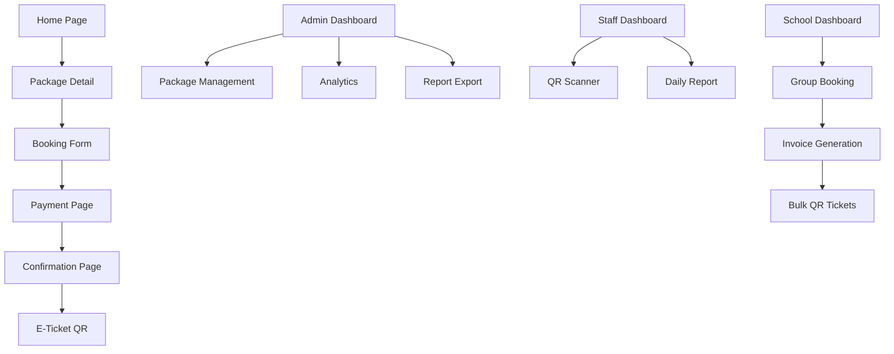

## 1. Product Overview
Sistem manajemen tiket wisata dan edukasi lingkungan untuk Sungai Cikapundung - Dago, Bandung yang dikelola oleh startup MoedaTrace. Sistem ini memungkinkan pengelolaan booking tiket secara online dengan fitur dynamic pricing, kuota harian, dan validasi QR code untuk wisatawan personal, rombongan sekolah, dan grup.

Produk ini membantu MoedaTrace mengelola kunjungan wisata secara efisien, mencegah overbooking, dan memberikan pengalaman booking yang seamless bagi wisatawan domestik maupun mancanegara.

## 2. Core Features

### 2.1 User Roles
| Role | Registration Method | Core Permissions |
|------|---------------------|------------------|
| Admin | Manual creation by system owner | Full CRUD packages, revenue reports, quota management, price setting |
| Staff | Admin invitation | Read-only reports, QR check-in scanning |
| User | Self-registration via email | Personal booking, booking history |
| School | Self-registration with verification | Group booking, invoice generation, bulk booking management |

### 2.2 Feature Module
Sistem ticketing terdiri dari halaman-halaman berikut:
1. **Halaman Utama**: Hero section, navigasi, daftar paket wisata, informasi sungai.
2. **Halaman Paket Detail**: Informasi paket, harga dynamic, form booking, pilih tanggal.
3. **Halaman Booking**: Form pesanan, input jumlah peserta, total harga real-time.
4. **Halaman Pembayaran**: Integrasi payment gateway, status pembayaran.
5. **Halaman Konfirmasi**: E-ticket dengan QR code, detail booking, email konfirmasi.
6. **Dashboard Admin**: Analytics revenue, manajemen paket, laporan kunjungan, export CSV.
7. **Dashboard Staff**: Scan QR check-in, lihat laporan harian.
8. **Profil User**: Riwayat booking, pengaturan akun.
9. **Halaman Login/Register**: Autentikasi multi-role.

### 2.3 Page Details
| Page Name | Module Name | Feature description |
|-----------|-------------|---------------------|
| Halaman Utama | Hero section | Tampilkan gambar sungai Cikapundung dengan deskripsi wisata edukasi. |
| Halaman Utama | Paket Wisata | List paket dengan harga dynamic, kuota tersedia, dan tombol booking. |
| Halaman Detail Paket | Informasi Paket | Tampilkan deskripsi lengkap, harga, syarat ketentuan, galeri foto. |
| Halaman Detail Paket | Form Booking | Pilih tanggal kunjungan, input jumlah peserta, hitung otomatis total harga. |
| Halaman Booking | Review Pesanan | Konfirmasi detail pesanan, pilih metode pembayaran. |
| Halaman Pembayaran | Payment Gateway | Integrasi dengan provider pembayaran, redirect ke external payment page. |
| Halaman Konfirmasi | E-Ticket | Tampilkan QR code unik, detail booking, tombol download PDF. |
| Dashboard Admin | Manajemen Paket | CRUD paket wiseta, set harga dynamic, aktif/nonaktif paket. |
| Dashboard Admin | Analytics | Tampilkan revenue harian/bulanan, total pengunjung, occupancy rate. |
| Dashboard Admin | Laporan | Export CSV untuk laporan keuangan dan kunjungan. |
| Dashboard Staff | QR Scanner | Scan QR code untuk check-in, tampilkan status tiket. |
| Dashboard Staff | Daily Report | Lihat daftar kunjungan harian dengan filter tanggal. |
| Profil User | Riwayat Booking | List semua booking dengan status, filter by tanggal. |
| Profil User | Pengaturan Akun | Update profil, ubah password. |

## 3. Core Process

### User Flow (Personal Booking)
1. User mengunjungi halaman utama dan melihat daftar paket wisata
2. User memilih paket dan masuk ke halaman detail
3. User memilih tanggal kunjungan dan jumlah peserta
4. Sistem menghitung harga total berdasarkan dynamic pricing
5. User mengisi data diri dan melakukan pembayaran
6. Setelah pembayaran sukses, sistem generate QR ticket dan kirim email
7. User dapat download e-ticket dengan QR code

### School Flow (Group Booking)
1. Sekolah register akun dengan verifikasi dokumen
2. Sekolah login dan pilih paket sekolah
3. Input jumlah peserta (minimal 50 untuk diskon)
4. Sistem otomatis hitung diskon bulk (10% untuk 50+, 15% untuk 100+)
5. Generate invoice dan lakukan pembayaran
6. Sistem kirim multiple QR tickets untuk setiap peserta
7. Sekolah dapat download semua tiket dalam satu PDF

### Admin Flow
1. Admin login ke dashboard
2. Kelola paket wiseta (CRUD operations)
3. Set harga dynamic dan promo periode
4. Monitor real-time occupancy dan revenue
5. Export laporan untuk analisis bisnis
6. Kelola kuota harian per paket

## 4. User Interface Design

### 4.1 Design Style
- **Primary Colors**: Hijau alam (#2D8F47) untuk tema lingkungan
- **Secondary Colors**: Biru sungai (#4A90E2) dan krem natural (#F5F5DC)
- **Button Style**: Rounded corners dengan shadow halus, hover effect
- **Font**: Inter untuk heading, Open Sans untuk body text
- **Font Sizes**: Heading 24-32px, Body 14-16px, Small 12px
- **Layout**: Card-based design dengan grid system responsive
- **Icons**: Phosphor Icons atau Heroicons dengan style outline

### 4.2 Page Design Overview
| Page Name | Module Name | UI Elements |
|-----------|-------------|-------------|
| Halaman Utama | Hero section | Full-width banner dengan gambar sungai, overlay text putih, CTA button hijau prominen. |
| Halaman Utama | Paket Cards | Grid 2-3 kolom, card dengan border radius 12px, shadow medium, badge kuota tersedia. |
| Detail Paket | Info Section | Tab navigation untuk deskripsi, harga, syarat. Sticky booking form di sidebar kanan. |
| Booking Form | Date Picker | Calendar widget dengan disable tanggal penuh, real-time kuota indicator. |
| Dashboard Admin | Analytics Cards | Card metrics dengan icon, angka besar, trend indicator naik/turun warna hijau/merah. |
| QR Scanner | Camera View | Full-screen camera dengan overlay scan area, beep sound saat scan berhasil. |

### 4.3 Responsiveness
- Desktop-first approach dengan breakpoint: Desktop (1200px+), Tablet (768-1199px), Mobile (<768px)
- Touch optimization untuk QR scanner dan date picker di mobile
- Collapsible navigation menu untuk mobile view
- Responsive grid yang menyesuaikan jumlah kolom berdasarkan screen size

### 4.4 3D Scene Guidance
Tidak applicable untuk project ini karena fokus pada sistem booking tiket, bukan visualisasi 3D.