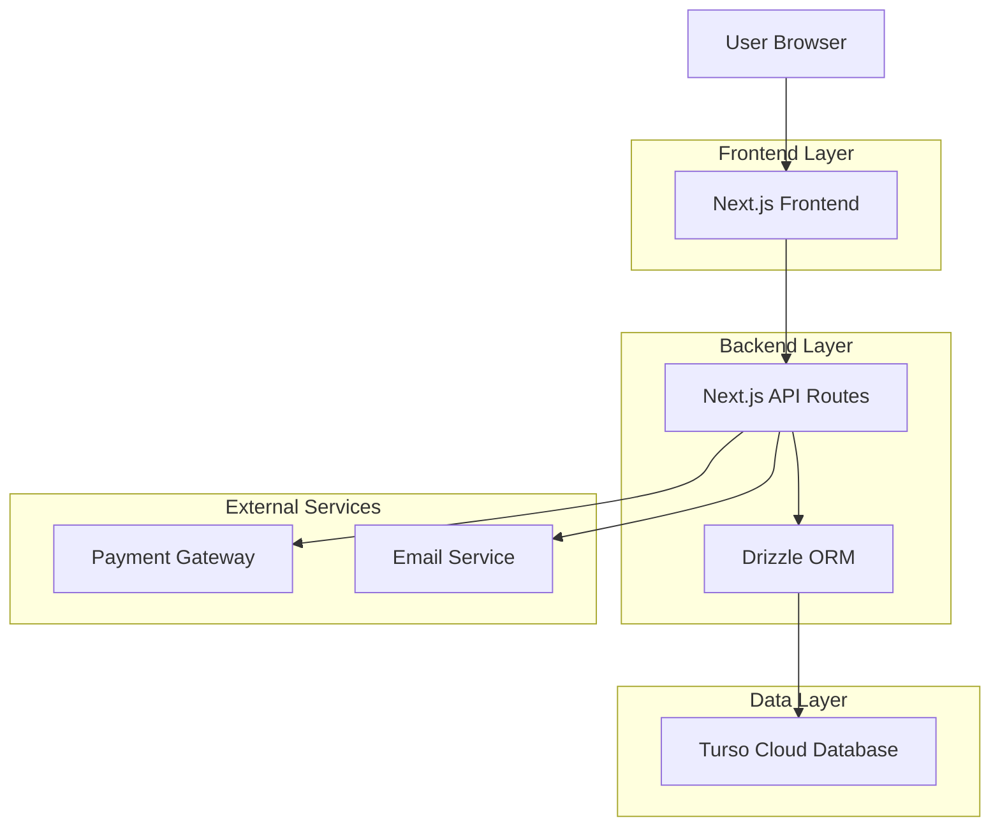
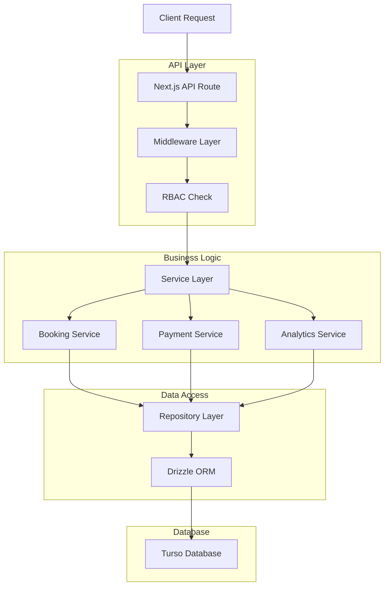
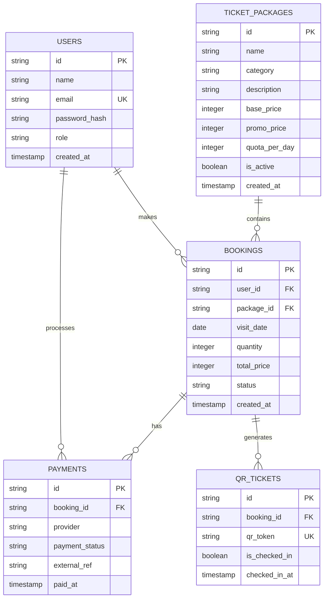

## 1. Architecture Design



## 2. Technology Description

- **Frontend**: Next.js 14 (App Router) + TypeScript + TailwindCSS
- **Initialization Tool**: create-next-app
- **Backend**: Next.js API Routes (Route Handlers)
- **Database**: Turso Cloud (LibSQL) with Drizzle ORM
- **Validation**: Zod schema validation
- **Authentication**: NextAuth.js dengan JWT strategy
- **Payment**: Midtrans/Xendit (webhook support)
- **Email**: Resend/Nodemailer
- **QR Code**: qrcode.js library
- **Deployment**: Vercel dengan environment-based config

## 3. Route Definitions

| Route | Purpose |
|-------|---------|
| / | Home page, daftar paket wisata |
| /paket/[id] | Detail paket dan form booking |
| /booking/[id] | Halaman konfirmasi booking |
| /payment/[id] | Halaman pembayaran |
| /ticket/[id] | E-ticket dengan QR code |
| /auth/login | Halaman login multi-role |
| /auth/register | Registrasi user baru |
| /dashboard/admin | Dashboard admin lengkap |
| /dashboard/staff | Dashboard staff untuk scan QR |
| /dashboard/school | Dashboard khusus sekolah |
| /profile | Profil user dan riwayat booking |
| /api/auth/* | NextAuth.js endpoints |
| /api/packages/* | CRUD paket wisata |
| /api/bookings/* | Booking management |
| /api/payments/* | Payment processing |
| /api/analytics/* | Analytics data |

## 4. API Definitions

### 4.1 Authentication APIs

```
POST /api/auth/login
```

Request:
| Param Name | Param Type | isRequired | Description |
|------------|-------------|-------------|-------------|
| email | string | true | Email user |
| password | string | true | Password user |
| role | string | true | Role: user/school |

Response:
```json
{
  "success": true,
  "token": "jwt_token_here",
  "user": {
    "id": "uuid",
    "name": "User Name",
    "email": "user@email.com",
    "role": "user"
  }
}
```

### 4.2 Package APIs

```
GET /api/packages
```

Response:
```json
{
  "success": true,
  "data": [
    {
      "id": "uuid",
      "name": "Paket Edukasi Sungai",
      "category": "personal",
      "description": "Deskripsi paket",
      "base_price": 50000,
      "promo_price": 45000,
      "quota_per_day": 100,
      "is_active": true
    }
  ]
}
```

### 4.3 Booking APIs

```
POST /api/bookings/create
```

Request:
| Param Name | Param Type | isRequired | Description |
|------------|-------------|-------------|-------------|
| package_id | string | true | ID paket yang dipilih |
| visit_date | string | true | Tanggal kunjungan (YYYY-MM-DD) |
| quantity | number | true | Jumlah peserta |
| user_type | string | true | personal/school |

Response:
```json
{
  "success": true,
  "data": {
    "booking_id": "uuid",
    "total_price": 225000,
    "status": "pending",
    "payment_url": "https://payment-gateway.com/..."
  }
}
```

### 4.4 Payment Webhook

```
POST /api/payments/webhook
```

Request dari payment gateway:
```json
{
  "booking_id": "uuid",
  "payment_status": "success",
  "external_ref": "payment_123",
  "paid_at": "2024-01-15T10:00:00Z"
}
```

## 5. Server Architecture Diagram



## 6. Data Model

### 6.1 Data Model Definition



### 6.2 Data Definition Language

**Users Table**
```sql
CREATE TABLE users (
  id TEXT PRIMARY KEY DEFAULT (lower(hex(randomblob(16)))),
  name TEXT NOT NULL,
  email TEXT UNIQUE NOT NULL,
  password_hash TEXT NOT NULL,
  role TEXT CHECK (role IN ('admin', 'staff', 'user', 'school')) DEFAULT 'user',
  created_at TEXT DEFAULT CURRENT_TIMESTAMP
);

CREATE INDEX idx_users_email ON users(email);
CREATE INDEX idx_users_role ON users(role);
```

**Ticket Packages Table**
```sql
CREATE TABLE ticket_packages (
  id TEXT PRIMARY KEY DEFAULT (lower(hex(randomblob(16)))),
  name TEXT NOT NULL,
  category TEXT CHECK (category IN ('personal', 'school')) NOT NULL,
  description TEXT NOT NULL,
  base_price INTEGER NOT NULL,
  promo_price INTEGER,
  quota_per_day INTEGER NOT NULL DEFAULT 50,
  is_active BOOLEAN DEFAULT true,
  created_at TEXT DEFAULT CURRENT_TIMESTAMP
);

CREATE INDEX idx_packages_active ON ticket_packages(is_active);
CREATE INDEX idx_packages_category ON ticket_packages(category);
```

**Bookings Table**
```sql
CREATE TABLE bookings (
  id TEXT PRIMARY KEY DEFAULT (lower(hex(randomblob(16)))),
  user_id TEXT NOT NULL,
  package_id TEXT NOT NULL,
  visit_date TEXT NOT NULL,
  quantity INTEGER NOT NULL,
  total_price INTEGER NOT NULL,
  status TEXT CHECK (status IN ('pending', 'paid', 'cancelled')) DEFAULT 'pending',
  created_at TEXT DEFAULT CURRENT_TIMESTAMP,
  FOREIGN KEY (user_id) REFERENCES users(id),
  FOREIGN KEY (package_id) REFERENCES ticket_packages(id)
);

CREATE INDEX idx_bookings_user ON bookings(user_id);
CREATE INDEX idx_bookings_package ON bookings(package_id);
CREATE INDEX idx_bookings_date ON bookings(visit_date);
CREATE INDEX idx_bookings_status ON bookings(status);
```

**Payments Table**
```sql
CREATE TABLE payments (
  id TEXT PRIMARY KEY DEFAULT (lower(hex(randomblob(16)))),
  booking_id TEXT UNIQUE NOT NULL,
  provider TEXT NOT NULL,
  payment_status TEXT CHECK (payment_status IN ('pending', 'success', 'failed')) DEFAULT 'pending',
  external_ref TEXT,
  paid_at TEXT,
  created_at TEXT DEFAULT CURRENT_TIMESTAMP,
  FOREIGN KEY (booking_id) REFERENCES bookings(id)
);

CREATE INDEX idx_payments_booking ON payments(booking_id);
CREATE INDEX idx_payments_status ON payments(payment_status);
```

**QR Tickets Table**
```sql
CREATE TABLE qr_tickets (
  id TEXT PRIMARY KEY DEFAULT (lower(hex(randomblob(16)))),
  booking_id TEXT NOT NULL,
  qr_token TEXT UNIQUE NOT NULL,
  is_checked_in BOOLEAN DEFAULT false,
  checked_in_at TEXT,
  created_at TEXT DEFAULT CURRENT_TIMESTAMP,
  FOREIGN KEY (booking_id) REFERENCES bookings(id)
);

CREATE INDEX idx_tickets_booking ON qr_tickets(booking_id);
CREATE INDEX idx_tickets_token ON qr_tickets(qr_token);
CREATE INDEX idx_tickets_checkin ON qr_tickets(is_checked_in);
```

**Booking Quota Validation Trigger**
```sql
CREATE TRIGGER prevent_overbooking
BEFORE INSERT ON bookings
FOR EACH ROW
WHEN NEW.status = 'paid'
BEGIN
  SELECT CASE
    WHEN (SELECT COUNT(*) FROM bookings b 
          WHERE b.package_id = NEW.package_id 
          AND b.visit_date = NEW.visit_date 
          AND b.status = 'paid') + NEW.quantity > 
         (SELECT quota_per_day FROM ticket_packages WHERE id = NEW.package_id)
    THEN RAISE(ABORT, 'Quota exceeded for this date')
  END;
END;
```